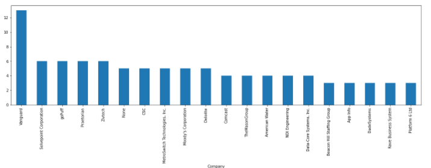

<div id="top"></div>

<!-- HEADER -->
<br />
<div align="center">
    

  <h3 align="center">Indeed Web Scraper</h3>

  <p align="center">
    Scrape job postings
    <br />
    <br />
  </p>
</div>

<!-- ABOUT -->
## About



A tool for scraping Indeed and pushing the results to a csv file. The results then can be used for data analysis. This repository includes sample datasets and Jupyter Notebooks.  

The scraper has been tested to be operational as of February 2022. Any changes to the Indeed website may break the script until a future release. 

### Built With

* [Python](https://www.python.org/)
* [Mozilla's Geckodriver](https://github.com/mozilla/geckodriver/releases)
* [Selenium](https://www.selenium.dev/)
* [Pandas](https://pandas.pydata.org/)
* [BeautifulSoup](https://beautiful-soup-4.readthedocs.io/en/latest/)

<!-- GETTING STARTED -->
## Getting Started

### Prerequisites

You will need to have [Firefox](https://www.mozilla.org/en-US/firefox/new/) installed.

You will need to ensure you have the correct driver executable for your system. Both the Linux and Windows versions of geckodriver have been included in this repository. If you require a different version, go to the [geckodriver releases page](https://github.com/mozilla/geckodriver/releases/).

### Installation

1. Clone the repo.
2. Ensure to use the correct executable driver for your OS.  
3. Ensure that the driver path is correct before running this script.
4. Install the following modules:

```bash
pip install pandas
pip install bs4
pip install selenium
```

<!-- USAGE EXAMPLES -->
## Usage

Run `scraper.py`. You will then be prompted to enter a job position and location to search for. Press enter after prompt to continue. 

A Firefox window will open and the script will scrape the job postings that are returned. You'll see warnings about deprecated features. This will be fixed in a future release.

To adjust the amount of job posts that you want in the dataset, change the "postings" variable to the amount desired. You can find the exact number by looking in the url where &start= is equal to the amount of postings.

The script will create a csv file that can then be used for data analysis. You can find code examples in the directory for a particular year > notebooks directory. 


<!-- CONTRIBUTING -->
## Contributing

Any contributions you make are **greatly appreciated**.

If you have a suggestion that would make this better, please fork the repo and create a pull request.

1. Fork the Project
2. Create your Feature Branch (`git checkout -b feature/MyGreatFeatureRequest`)
3. Commit your Changes (`git commit -m 'Add some features'`)
4. Push to the Branch (`git push origin feature/MyGreatFeatureRequest`)
5. Open a Pull Request

<!-- LICENSE -->
## License

Distributed under the GPLv3 License. See `LICENSE` for more information.

geckodriver is made available under the [Mozilla Public License](https://www.mozilla.org/en-US/MPL/2.0/).

<p align="right">(<a href="#top">back to top</a>)</p>